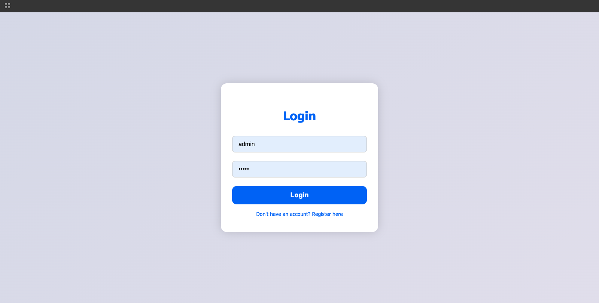
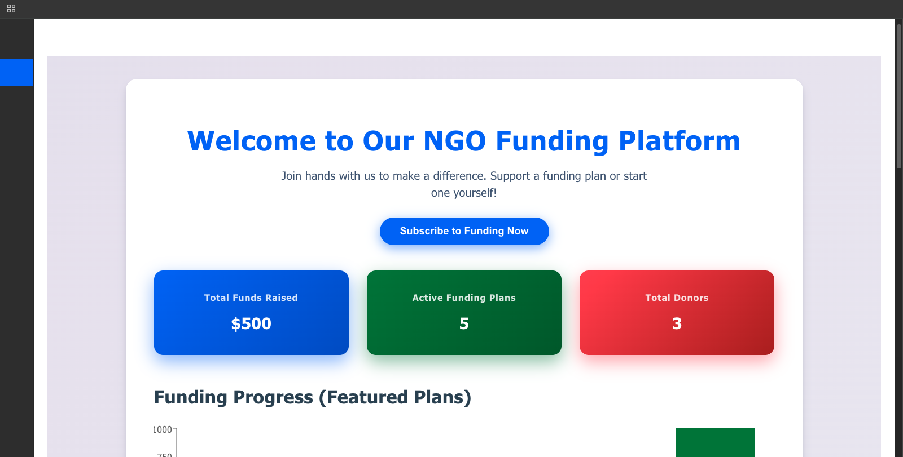
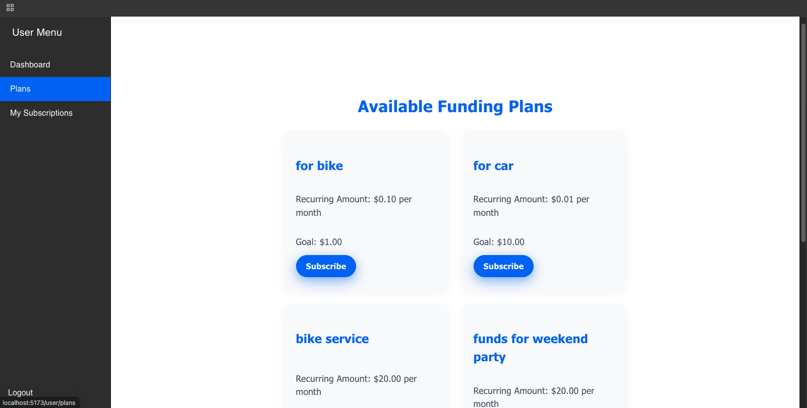
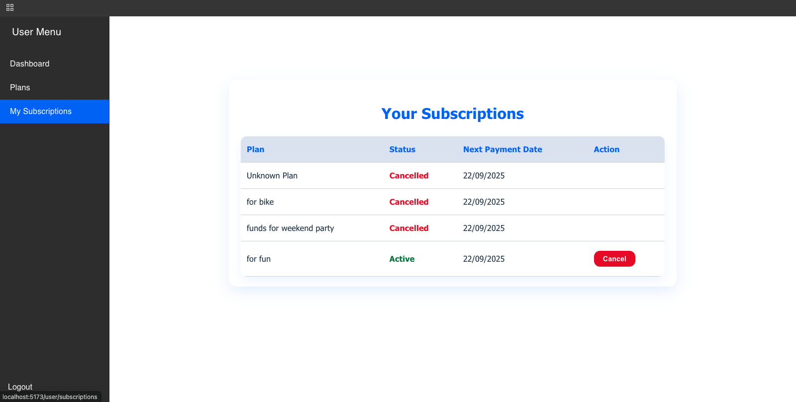

# Event Subscription Application

This project is a complete event subscription system with a **backend API** (Node.js, Express, MongoDB) and a **frontend** (React, Material-UI). It supports role-based access, subscription management, notifications, and analytics.

---

## Project Snapshot & Demo

[Demo Link](https://drive.google.com/file/d/1Nj6S9kCJB79SObS-jqVliBdeV361NyhK/view?usp=sharing)

  




---

## Backend

### Overview

- RESTful API providing user authentication, plan management, subscription management, and analytics.
- Notification queue schedules payment success and reminder notifications with delay and retries.
- Rate limiting applied on `register` and `login` endpoints for security.

### API Routes

- **User Routes** (`/api/users`)
  - `POST /register` - Register a new user (rate limited)
  - `POST /login` - Login user (rate limited)

- **Plan Routes** (`/api/plans`)
  - `POST /` - Create a plan (Admin only)
  - `GET /` - Get all active plans (public)
  - `GET /all` - Get all plans including inactive (Admin only)
  - `PATCH /:id` - Deactivate a plan (Admin only)
  - `PATCH /reactivate/:id` - Reactivate a plan (Admin only)

- **Subscription Routes** (`/api/subscriptions`)
  - `POST /` - Create a subscription
  - `GET /:userId` - Get user subscriptions
  - `PATCH /cancel/:subscriptionId` - Cancel a subscription

- **Analytics Routes** (`/api/analytics`)
  - `GET /dashboard-stats` - Get analytics data

### Notification Queue

When a subscription is created:

- A payment success notification is enqueued and sent immediately.
- A payment reminder notification is scheduled 1 day before the next payment date with retry attempts.

```
await notificationQueue.add({
type: "paymentSuccess",
data: {
email: customerEmail,
userName,
planName: subscription.plan.name || "Your Plan",
amount: subscription.plan.amount || 0,
},
});

const now = new Date();
const reminderDate = new Date(subscription.nextPaymentDate);
reminderDate.setDate(reminderDate.getDate() - 1);
const delayMs = reminderDate.getTime() - now.getTime();

if (delayMs > 0) {
await notificationQueue.add(
{
type: "paymentReminder",
data: {
email: customerEmail,
userName,
planName: subscription.plan.name || "Your Plan",
amount: subscription.plan.amount || 0,
},
},
{ delay: delayMs, attempts: 3 }
);
}
```

## Frontend

### Overview

- React app with role-based layouts for Admin and Users.
- Admins can create and manage plans.
- Users can view a dashboard, subscribe to events, cancel subscriptions, and see analytics.
- Uses Material-UI drawer navigation with responsive design.
- Integrates with backend via Redux Toolkit Query.
- Implements frontend subscription cancel option and analytics viewing.

## Setup Instructions

### Backend

1. Install dependencies:

```
npm install
```

2. Configure environment variables by creating a `.env` file with:

```
PORT=
MONGO_URI=
EMAIL_USER=
EMAIL_PASS=
```

3. Run backend server:

```
npm run dev
```

### Frontend

1. Navigate to frontend folder (if separate):

```
cd front
```

2. Install dependencies:

```
npm install
```

3. Start frontend app:

```
npm run dev
```

## Additional Important Code Snippets

### Rate Limiting on Auth Routes

```
import rateLimit from "express-rate-limit";

export const authLimiter = rateLimit({
windowMs: 15 * 60 * 1000, // 15 minutes
max: 10,
message: "Too many requests from this IP, please try again after 15 minutes.",
});
```

Apply in routes:

```
router.post("/register", authLimiter, register);
router.post("/login", authLimiter, login);

```
